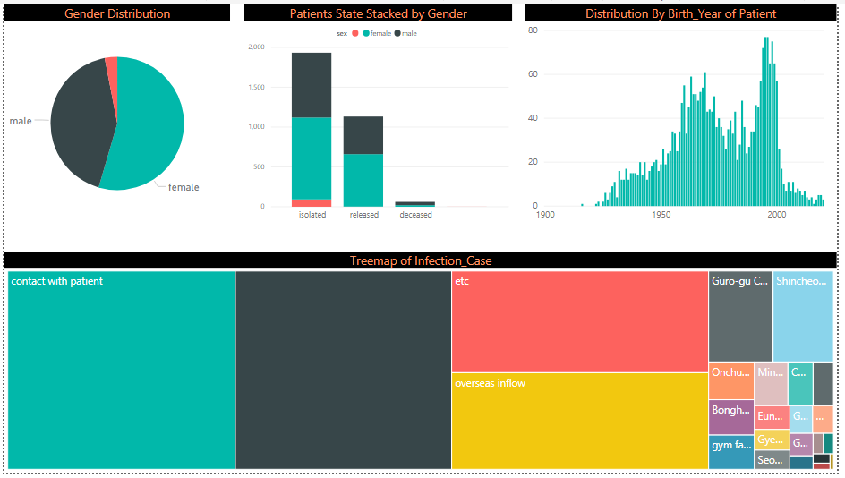
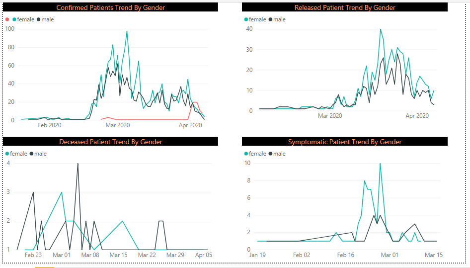

# Introduction

This is a Power BI application that is created using a data retrived from TigerGraph database using Rest API.

The application is basically created over a Covid-19 base present in TigerGraph Cloud.
It gets attribute data of all patients which can further be utilized for analysis using Power BI.

The purpose behind this application is to show how a data specific to any qeury be available from TigerGraph database
and used in Power BI for typical tasks like Data Analysis, Visualization, Dashboarding etc.

## Screenshots

## Prequisite:

1. A solution created on covid-19 base present in TigeGraph.
2. Power BI Desktop.

## Steps:

1. Start the Covid-19 solution.

2. Open it in Graphstudio Application.

3. On Graphstudio homepage for Covid-19 solution, load data using a play button.

4. Once data is loaded, go to 'Write Query'.

5. Create a new qeury which will give output as a list of all Patients with their Attributes like ID,Birth_Year etc.
The qeury is:
CREATE QUERY AllSelect() FOR GRAPH MyGraph {
	seed = {Patient.*};
	Result = Select s From seed:s;
	Print Result;
}

6. Save the qeury and install it.

7. Once qeury is installed, get its endpoint link and note it down.

8. Go to GraphStudio admin page and enter into User Management screen.

9. Create New Secret and copy it to note down.

10. Now is the time to generate a token wich is required for authentication to a API endpoint link from external software. 
For that command goes like below

curl -k -X GET "https://YOUR_SUBDOMAIN_NAME.i.tgcloud.io:9000/requesttoken?secret=YOUR_SECRET&lifetime=1000000"

Replace YOUR_SUBDOMAIN_NAME and YOUR_SECRET specific to your instance and run the curl command in command line.
After running succefully, you will get a Token. Note it down.

11. Go to Power BI. Click on 'Get Data'. Chose option as 'Web'.

12. Select 'Advanced' radio button.

13. Enter API endpoint link in URL Part.
Under HTTP Request HEader Parameter,
Chose 'Authorization' and enter its value in next textbox as 'Bearer <YOUR_TOKEN>'. Note <YOUR_TOKEN> should be replaced with token you generated and noted.
Click 'OK'.

14. In a short while, data will be avaliable in Power Query. The data can then be modified suitable to our requirement using power query skills.

15. Once data is loaded properly in Power BI tables, then we can perform Power BI analytical tasks over it. (e.g. Visualization etc)
